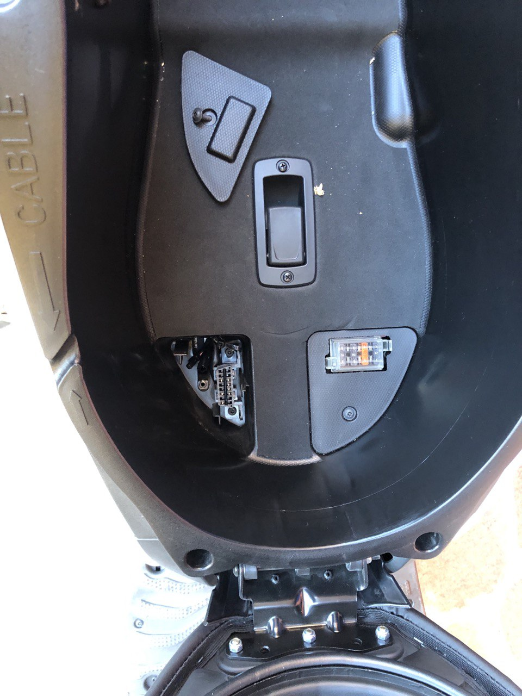
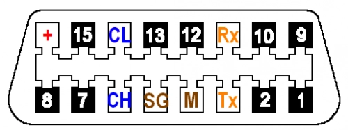
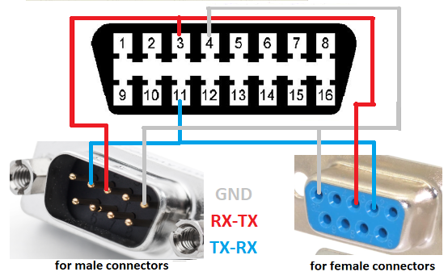
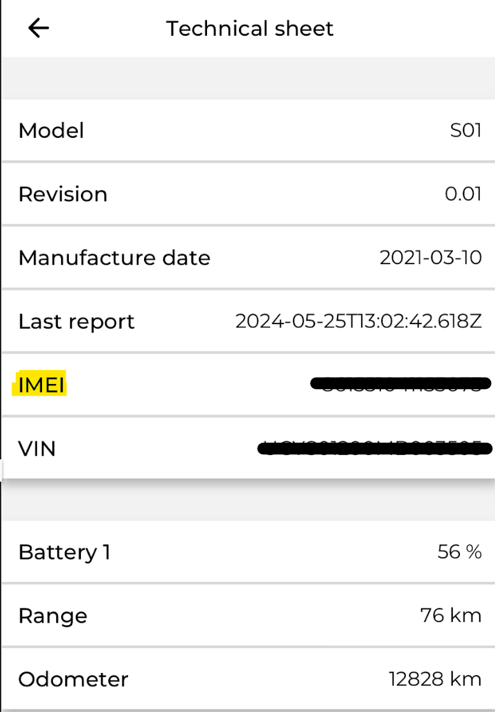
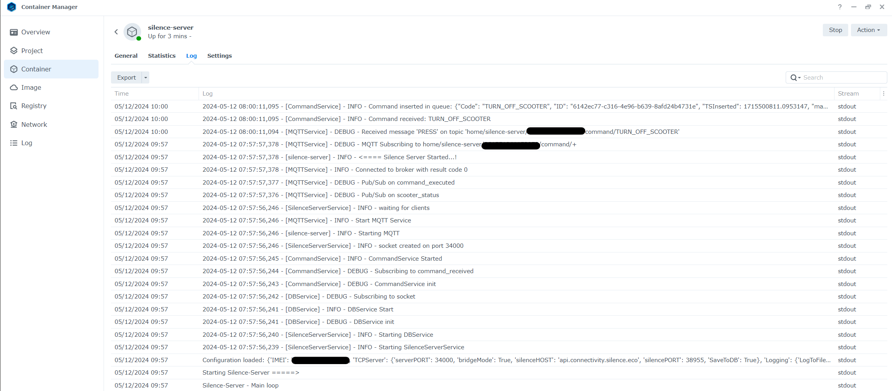
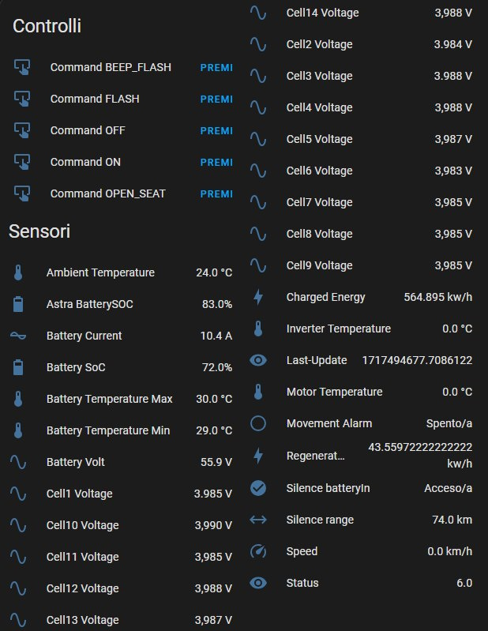
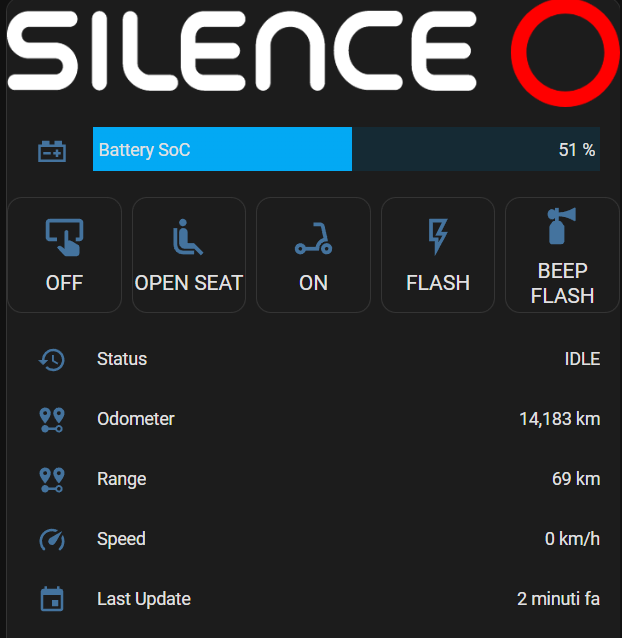
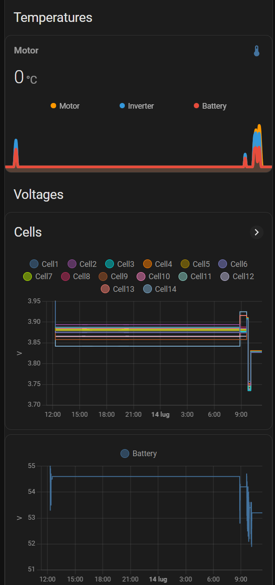

# Silence Private Server for Astra GPS Module
This is a self-hosted server solution for interfacing with the Astra GPS module of Silence electric scooters.\
This project empowers owners to maintain control over their data, ensuring **privacy** and **independence** from the manufacturer.

This project was developed initially and primarily by [**Andrea Gasparini**](https://www.linkedin.com/in/andrea-gasparini-a14824143) @88gaspa88 (88gaspa88@gmail.com).\
We also thank the technical contributions on the [Elektroroller forum](https://www.elektroroller-forum.de/viewforum.php?f=128)

If you like this project you can support us with :coffee: or simply put a :star: to this repository :blush:
<a href="https://www.buymeacoffee.com/lorenzodeluca" target="_blank">
  
</a>

[](https://www.buymeacoffee.com/lorenzodeluca)
> **Warning**
> :warning: This software was developed by analyzing frames from/to Silence Servers, it was not sponsored or officially supported by **Silence**
> If someone from **Silence** would like to contribute or collaborate please contact me at [me@lorenzodeluca.dev](mailto:me@lorenzodeluca.dev?subject=[GitHub]Silence-Private-Server)

## Contents
- [How it works](#how-it-works)
- [Astra Module Configuration](#astra-module-configuration)
- [Installation](#installation)
- [MQTT Integration](#mqtt-integration)
- [Home Assistant Integration](#home-assistant-integration)
- [FAQ](#faq)
- [Support](#support)
- [Contributing](#contributing)

### Tested on Silence Scooters
- [x] Silence S01 Connected
- [ ] Testing ongoin on **Seat Mò** and **Silence S01+**

## How It Works
**SilencePrivateServer** acts as a replacement for the Silence server.\
It connects your Silence scooter to **your own private server**, effectively giving you control over your data.\
Here's a brief overview of how it works:

1. **Astra Module Configuration**: The Astra module parameters need to be modified to connect to **your private server instead of the Silence server**.
2. **TCP Port Forwarding**: Your scooter connects to your private server through a **TCP port**. This port needs to be **exposed using port forwarding**.
3. **Dynamic DNS**: If you don't have a static public IP, you'll need to set up a dynamic DNS.
4. **24/7 Host**: You will need a host that is up and running 24/7 to install the server (Docker, Linux or Windows) and a **MQTT Daemon** in your local network.

Once the Scooter is interfaced with your private server, it **periodically connects** to the server through the exposed port and publishes its **state via MQTT**.\
It will also be possible to send commands to the scooter like Silence App: Power On, Power Off, Open Seat, Blink Lights and Horn

### Astra Module Configuration
To configure the Astra module, a **serial connection** to the module is required.
The serial interface is easily connected via the **ODB port in the under seat**. \


The pinout of the ODB port is as follows. \


To configure the Astra module, you need to follow these steps:

1. **TX and RX Connection**: Connect the TX and RX pins as shown in the image below.  
2. **Serial Connection**: Connect to the Astra module via **RS232 serial port** with connection parameters **115200 baud, 8, N, 1**.
3. **Terminal Commands**: Once connected, enter the following commands in the terminal:
    - `$IPAD1, #PUBLIC_IP#` , change **#PUBLIC_IP** with your IP or Dynamic DNS FQDN
    - Optionally, you can also set the port with `$PORT1,#PORT#`. By default, it is set to **38955** as Silence Server.

Please note that you need to replace `#PUBLIC_IP#` and `#PORT#` with your actual public IP address and desired port number respectively.

## Installation
Once clone the project, you need to configure and running the server, follow these steps:

### Find Your IMEI
First, you need to determine your IMEI. \
You can do this by going to the Silence app, selecting "My Vehicles", choosing your scooter, and then going to "**Technical Sheet**". \


If you cannot find your IMEI there is **no problem**, \
when you install the server and the scooter attempts to connect to the server you will see the IMEI in the server logs.

### Create Configuration File
Next, copy the '**configuration.template.json**' file and create a new file named '**configuration.json**'. \
In this file, specify the following parameters: \
- `IMEI`: Enter the IMEI of your Astra module, which you determined in the previous step.
- `ServerPort`: If you modified this in the module configuration, enter the new value. Otherwise, leave it as the default 38955.
- `bridgeMode`: If set to true, the server will still send data to the Silence server, allowing the Silence app to function normally.
    If you do not want to send data to Silence (which will cause the app to stop working), set this to FALSE.
- `MQTT broker`: Configure **port**, **user**, **pass** of your local MQTT Broker.

## Running the Server
Once you have configured your '**configuration.json**'file, you can run the server. Here are the steps:

### Running as Script
1. **Install Python Libraries**: First, install the necessary Python libraries by running the following command in your terminal:
    ```shell
    pip install -r requirements.txt
    ```
2. **Run as a Script**: You can run the server as a script. To do this, navigate to the directory containing your server script and run it using Python.
    ```shell
    python silence-server.py
    ```

### Run as a Docker Container
Alternatively, you can run the server as a Docker container. To do this, you need to build a Docker image and map the '**configuration.json**' file.\
Command to build the Docker image:
  ```shell
  docker build -t silence-private-server .
  ```
And here's the command to run the Docker container, mapping the '**configuration.json**' file:
  ```shell
    docker run
    --name silence-server
    --detach --restart unless-stopped 
    --publish **#PORT#**:**#PORT#** 
    --v **local_configuration.json**:/app/configuration.json:ro 
    silence-private-server
  ```

#### Run as Docker without build
If you prefer, you can use the image I have already created of this project.
 ```shell
    docker run
    --name silence-server
    --detach --restart unless-stopped
    --publish **#PORT#**:**#PORT#**
    --v **local_configuration.json**:/app/configuration.json:ro
    lorenzodleuca/silence-server:latest    
  ```

Here's an example of logs of a running server in Docker, with script the output should be more or less the same.


## MQTT Integration
After properly Module and Server configuration you have your own server and you will have your data locally.\
There you can integrate with any MQTT-compatible system; we will soon publish a sample configuration for Home Assistant.  :)

### Status Publishing
Server publishes the scooter's status to an MQTT topic every time it receives a message from the scooter. The base topic is defined in the configuration file (TopicPrefix), and the status is published to a topic composed as follows: `TopicPrefix/IMEI/status`.
The topic name definition is defined in file **scooter_status_definition.json**, but you can subscribe on status/# topic and see data.

Here's a brief overview of how it works:
- **MQTT Publishing**: The server is set up to publish to an MQTT topic. MQTT is a lightweight messaging protocol for small sensors and mobile devices, optimized for high-latency or unreliable networks. \
- **Topic Structure**: The MQTT topic to which the server publishes is composed of the base topic, **TopicPrefix** parameter, the **IMEI** of the scooter, and the word 'status'. \
So, if your **TopicPrefix** is `MyScooter` and your **IMEI** is `123456789`, \ 
the server would **publish status** to the MQTT topic `MyScooter/123456789/status`.

### Sending Commands
You can send commands to the scooter by publishing to an MQTT topic. The topic is composed of the base topic (TopicPrefix), the IMEI of the scooter, and the word 'command'. \ 
So, if your **TopicPrefix** is `MyScooter` and your **IMEI** is `123456789`, \ 
you would **publish commands** to the MQTT topic `MyScooter/123456789/command`.

Here are the possible commands you can send:

- **TURN_ON_SCOOTER**: Turns on the scooter.
- **TURN_OFF_SCOOTER**: Turns off the scooter.
- **OPEN_SEAT**: Opens the seat of the scooter.
- **FLASH**: Activates the scooter's flash.
- **BEEP_FLASH**: Activates the scooter's beep and flash.
- **STOP_FLASH**: Stops the scooter's flash.

To send a command, simply publish a message, with an empty payload, to the appropriate MQTT topic. \
For example, to turn on the scooter, you would publish `TURN_ON_SCOOTER` to topic `MyScooter/123456789/command`.

## Home Assistant Integration
Once you have everything set up and see the data on MQTT the integration with **Home Assistant** is quite simple if you are familiar with Home Assistant. \
In the file `**packages/scooter_package.yaml**` I leave you an example of configuration for data integration. \
You will obviously have to modify **YOUR_SCOOTER_IMEI** with your **IMEI** obtained in the previous steps.

Once this is done, if everything works, you should display the data on Home Assistant as in my case. \


### Lovelace
You can create various tabs like these. \



Here is the YAML code, you need some HACS Frontend integration installed
- [x] `vertical-stack-in-card`
- [x] `custom:mini-graph-card`

```YAML
type: custom:vertical-stack-in-card
cards:
  - type: picture
    image: local/dark_logo.png
  - type: custom:bar-card
    height: 35px
    entities:
      - entity: sensor.silence_batterysoc
        name: Battery SoC
  - type: horizontal-stack
    cards:
      - type: button
        name: 'OFF'
        entity: button.silence_scooter_device_command_off
        tap_action:
          action: toggle
      - type: button
        name: OPEN SEAT
        icon: mdi:seat-passenger
        entity: button.silence_scooter_device_command_open_seat
        tap_action:
          action: toggle
      - type: button
        entity: button.silence_scooter_device_silence_on
        name: 'ON'
        icon: mdi:scooter
        tap_action:
          action: toggle
      - type: button
        entity: button.silence_scooter_device_command_flash
        name: FLASH
        icon: mdi:flash-outline
        tap_action:
          action: toggle
      - type: button
        entity: button.silence_scooter_device_command_beep_flash
        name: BEEP FLASH
        icon: mdi:air-horn
        tap_action:
          action: toggle
  - type: entities
    entities:
      - entity: sensor.silence_status
        name: Status
      - entity: sensor.odo
        name: Odometer
      - entity: sensor.silence_range
        name: Range
      - entity: sensor.silence_velocity
        name: Speed
      - entity: sensor.silence_lastreporttime
        name: Last Update
  - type: glance
    title: Scooter
    entities:
      - entity: sensor.silence_name
        name: Name
      - entity: sensor.silence_color
        name: Color
      - entity: sensor.silence_model
        name: Model
      - entity: sensor.silence_manufacturedate
        name: Manufacture
      - entity: sensor.silence_frameno
        name: Frame
      - entity: sensor.silence_imei
        name: IMEI
      - entity: sensor.silence_alarmactivated
        name: Alarm
      - entity: sensor.silence_batteryout
        name: Battery Out
      - entity: sensor.silence_charging
        name: In Charging
    show_icon: false
  - type: map
    entities:
      - entity: device_tracker.silence_scooter_tracker
    dark_mode: true
    hours_to_show: 48
  - type: horizontal-stack
    title: Temperatures
    cards:
      - type: custom:mini-graph-card
        hours_to_show: 24
        points_per_hour: 10
        entities:
          - entity: sensor.silence_motortemperature
            name: Motor
          - entity: sensor.silence_invertertemperature
            name: Inverter
          - entity: sensor.silence_batterytemperature
            name: Battery
  - type: vertical-stack
    title: Voltages
    cards:
      - type: history-graph
        title: Cells
        entities:
          - entity: sensor.silence_cell1voltage
            name: Cell1
          - entity: sensor.silence_cell2voltage
            name: Cell2
          - entity: sensor.silence_cell3voltage
            name: Cell3
          - entity: sensor.silence_cell4voltage
            name: Cell4
          - entity: sensor.silence_cell5voltage
            name: Cell5
          - entity: sensor.silence_cell6voltage
            name: Cell6
          - entity: sensor.silence_cell7voltage
            name: Cell7
          - entity: sensor.silence_cell8voltage
            name: Cell8
          - entity: sensor.silence_cell9voltage
            name: Cell9
          - entity: sensor.silence_cell10voltage
            name: Cell10
          - entity: sensor.silence_cell11voltage
            name: Cell11
          - entity: sensor.silence_cell12voltage
            name: Cell12
          - entity: sensor.silence_cell13voltage
            name: Cell13
          - entity: sensor.silence_cell14voltage
            name: Cell14
      - type: history-graph
        entities:
          - entity: sensor.silence_voltbatteria
            name: Battery
```

## FAQ
1. **What cable are you using? Any reference would be appreciated!** \
Is a **null-modem RS232** cable, with a cheap **RS232-USB** adapter you just need to connect TX/RX and GND and open a serial terminal on your PC.

2. **Do you have any information on how to obtain the IMEI of the SEAT-MO? The app doesn't seem to provide it.** \
If you don't find IMEI no worry, at the first connection from Scooter to Server you see IMEI on server logs.
Anyway on the serial terminal you see IMEI too.

3. **Is there a way to back up the previous parameters (IP/Port) before reprogramming the Astra module's IP?** \
Original parameters (for my Silence, but some users confirm also for Seat) are \
`SERVER` ***api.connectivity.silence.eco***
`PORT` ***38955***

## Support
If you encounter any issues or have questions regarding the integration, please open an issue on this GitHub repository, and I will be happy to assist you. \
You can write to me at [me@lorenzodeluca.dev](mailto:me@lorenzodeluca.dev?subject=[GitHub]silence-private-server)

## Contributing
Contributions to the project are welcome! Please fork the repository, make your changes, and submit a pull request. \
Any help is welcome, if you have new implementations feel free to make pull requests :blush:
   
## License
GNU AGPLv3 © [Lorenzo De Luca][https://lorenzodeluca.dev]
